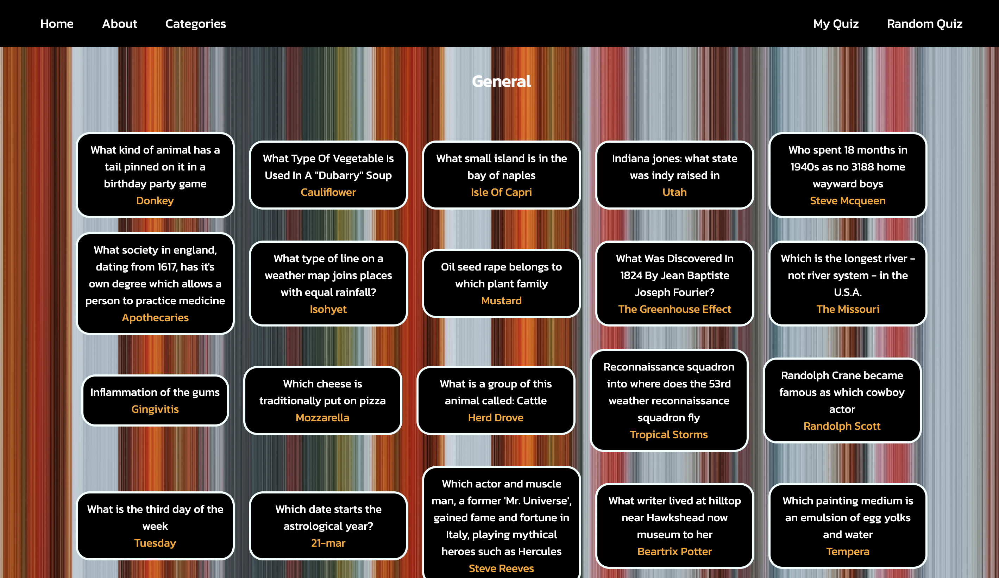
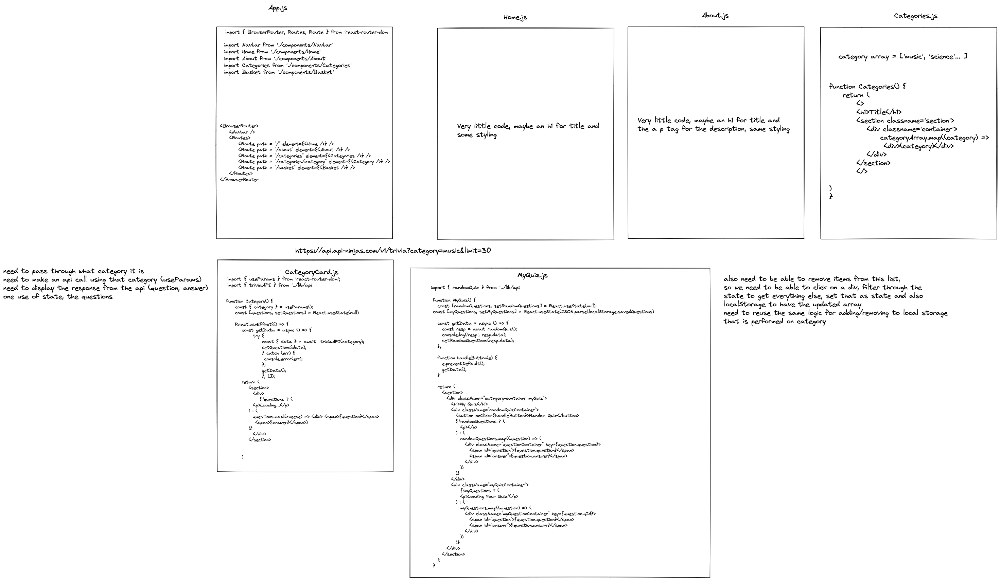
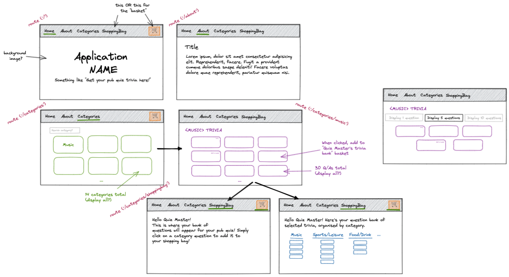

# Pub Quiz Generator - GA Project 2

Collaborators: Joe Deering & Emily Daykin

## Site Overview

Home Page

Category Pages

Quiz Pages

## Technologies Used:

- Front End: React
  - SPA Routing and Components
  - Packages: axios for API handling, UUID4 for unique IDs
- Styling: SCSS
- Version Control: Git
- Deployment: Netlify for deployment

## Installation Instructions:

- https://pub-quiz-generator-ga-sei62.netlify.app/
- Clone repo --> `npm install` --> `npm start`

## General Approach:

Initially, we decided to work with a free API from cocktail DB. Upon working with it and realising that our goals were somewhat limited by the API, and overshadowed by the corresponding website, we changed the API to one from API ninja, called trivia. Our new aim was to create a website that could be used to form a list of trivia questions that you could use to make a pub quiz, the user would navigate via category to a random selection of questions, and pick those they wanted to compile into a list, which the site would display. The latter functions being our stretch goals.

We began by pseudocoding out the necessary code and design of the different components. Our MVP was designated as a website that would display different trivia categories, and when they are clicked, they link to a new page that displays a selection of 30 questions from that category. The main difficulty getting to our MVP was the use of useParams, and then the accessing of the questions from the API. Once we reached our MVP, we concentrated on styling using vanilla CSS to give the site a more unique feel. Due to the limitations of the API, we had to come up with a way to make sure the questions all had unique IDs, allowing for us to reach our stretch goal, the ability to curate a list of chosen questions as well as a randomly generated one. Once we met these goals, we decided to refine the random category component by adding further options of amounts, as well as adding a counter to the My Quiz section on the Navbar, allowing for a clear indicator of how big the quiz is.

### Wireframes:

## Major Hurdles

The biggest hurdle was understanding the relationship between localStorage and state, and more specifically making sure that changes in one reflected in changes in the other, as well as making sure that these changes were apparent to the user through CSS.
